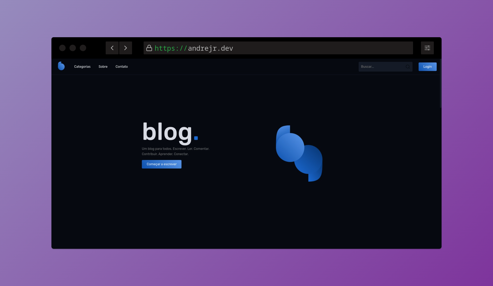

<h1 align="center">
    
    <br>
</h1>

<h4 align="center">
  <p>Blog.</p>

  <p>O Blog é um projeto desenvolvido em ReactJS para o curso FrontPush.</p>
</h4>

<p align="center">
  <a href="https://andrejr.dev">
    
  </a>
</p>


<p align="center">
  <a href="#rocket-tecnologias">Tecnologias</a>&nbsp;&nbsp;&nbsp;|&nbsp;&nbsp;&nbsp;
  <a href="#information_source-como-instalar">Como instalar</a>&nbsp;&nbsp;&nbsp;
</p>

<p align="center">
  
</p>

## :rocket: Tecnologias

Este projeto foi desenvolvido com as seguintes tecnologias:

- [HTML](https://developer.mozilla.org/pt-BR/docs/Web/HTML)
- [SASS](https://sass-lang.com/)
- [ReactJS](https://pt-br.reactjs.org/)
- [Typescript](https://www.typescriptlang.org/)
- [React Router](https://reactrouter.com/)
- [React Hook Forms](https://react-hook-form.com/)
- [Json Server](https://github.com/typicode/json-server#add-custom-routes)
- [Axios](https://github.com/axios/axios)

## :information_source: Como instalar

Para clonar e executar este aplicativo, você precisará do [Git](https://git-scm.com) instalado em seu computador. Da sua linha de comando:

```bash
# Clonar este repositório
$ git clone https://github.com/andrejr971/blog-frontpush.git

# Navegue até o repositório
$ cd blog-frontpush

#instale os pacotes
$ npm install

# Execute a aplicação em modo de desenvolvimento
$ npm run start

# A aplicação será aberta na porta:3000 - acesse http://localhost:300
```


---

Feito by André Junior :wave: [portifólio](https://andrejr.dev)
